# mplify

[](https://pypi.org/project/mplify/)
[](https://pypi.org/project/mplify/)
[](LICENSE)
[](https://pepy.tech/project/mplify)

Mplify (Matplotlib prettifier) is a Python package built around a single function, `mplify()`: add one line at the end of your plotting code, and it strips the clutter out of the figure and scales its style for a paper, a slide, or a poster.

`mplify()` has been growing since 2016 — first as the plotting helpers of my PhD, then as the plotting layer of [NeuroPyxels](https://github.com/m-beau/NeuroPyxels).

```python
import matplotlib.pyplot as plt
from mplify import mplify

plt.plot(x, y)
mplify() # applies to the last active figure/axis
```

Every common tweak you would otherwise struggle to find across matplotlib's API is an argument of that same function:

```python
mplify(xlim=(0, 3*np.pi), ylim=(-0.55, 0.85),                        # limits
       xticks=[0, np.pi, 2*np.pi, 3*np.pi],                          # tick positions
       xtickslabels=['0', 'π', '2π', '3π'],                          # tick label text
       xtickrot=45, xtickha='right',                                 # ...rotated, realigned
       yticks=[-0.4, 0, 0.4, 0.8],
       xlabel='Phase', ylabel='Amplitude (a.u.)',                    # labels and title
       title='mplify(**kwargs)',
       hlines=[0], lines_kwargs={'lw':1.5,'ls':':','color':'grey'},  # reference lines
       show_legend=True, legend_loc=(0.6, 0.62),                     # legend, placed by hand
       ticks_direction='in', lw=2, ticklab_s=15,                     # ticks, spines, fonts
       saveFig=True, saveDir='./figures',                            # save it: 500 dpi,
       figname='hero', _format='png')                                # text stays editable
```

<p align="center">
  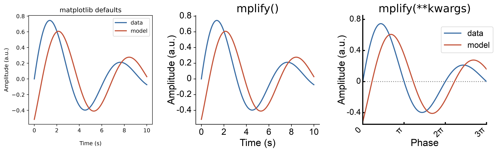
</p>

*(the third panel is that exact call, and `saveFig` is what wrote the PNG you are looking at — this README's hero image saves itself. See [`doc/make_figures.py`](doc/make_figures.py).)*


## Installation

```bash
pip install mplify        # or: uv add mplify
```

From source:

```bash
git clone https://github.com/m-beau/mplify.git
cd mplify && uv sync
```

Requires Python ≥ 3.10, matplotlib and numpy.

## The problem

Matplotlib is highly customizable through an extensive API, which comes at the cost of verbosity and complexity.

Say you want to rotate your x tick labels 30°, right-align them so they don't collide with the axis, bump the axis label font, and drop the top and right spines. Here is the matplotlib code to do so:

```python
ax.set_xticks(positions)
ax.set_xticklabels(labels, rotation=30, ha='right', fontsize=16, fontweight='regular')
ax.set_xlabel('Condition', size=18, labelpad=0)
ax.set_ylabel('Response', size=18, labelpad=0)
ax.tick_params(axis='both', width=1, length=4, direction='out',
               bottom=True, left=True, top=False, right=False)
ax.spines['top'].set_visible(False)
ax.spines['right'].set_visible(False)
for sp in ('left', 'bottom'):
    ax.spines[sp].set_lw(1)
```

Five different APIs (`set_xticks`, `set_xticklabels`, `set_xlabel`, `tick_params`, `spines`), three different spellings of the same concept (`fontsize`, `size`, `fontweight`/`weight`), and a potential ordering bug: ticks and limits interact, so calling them in the wrong order silently gives you a different figure.

The tweaks are all possible. They are just scattered across an API that makes you manage every piece of plot metadata by hand. So most of us end up doing one of three things:

1. copy-pasting the same 15 lines of boilerplate into every script;
2. re-googling "matplotlib rotate xticklabels" for the 200th time;
3. asking an LLM, which returns 40 lines of code, half of it redundant, and all of it subtly different from the 40 lines it gave you last week.

## The solution

`mplify()` is one callable with a flat, self-explanatory argument list. Everything above becomes:

```python
mplify(xticks=positions, xtickslabels=labels, xtickrot=30, xtickha='right', xlabel='Condition', ylabel='Response')
```

No object hierarchy to navigate, nothing extra to import, and the whole API fits in a single `mplify?` in your notebook — **your editor's autocomplete is the documentation**.

Three things make this work:

- **Sensible defaults.** Call `mplify()` with no arguments and it applies a handcrafted default styling: larger font sizes, fatter spines, top and right spines gone, ticks pointing out, editable text in saved PDFs.
- **Implicitly callable.** `mplify()` reads the current figure via `plt.gcf()`/`plt.gca()`, so you can just call it at the end of your script — whether you plot in matplotlib's explicit (object-oriented) or implicit (MATLAB-inherited, no figure or axis ever declared) style. You can always hand it `fig` and `ax` explicitly instead.
- **One flat layer of arguments.** Every common figure tweak is one self-explanatory keyword — `xtickrot`, `ticklab_s`, `hide_top_right`, `hlines`, `clabel`, `legend_loc`, `saveFig` — with nothing nested and no objects to construct. Anything you don't pass keeps mplify's default; anything you do pass wins.

The practical effect is that styling stops being a documentation lookup or an LLM call. You instead just check mplify's signature (arguments) on site. **No more context switching** - mplify makes matplotlib actually 'learnable'!

### "But an LLM writes that for me now"

It does, but that solved the *writing* problem (knowing the API), not the *reading* problem (verbosity). Your script still ends up with 40 lines of verbose code that take up a bunch of space and hurts your code's readability.

## mplify's origin story

The function grew organically since 2016, from the plotting helpers I wrote throughout my PhD, under the name `mplp()` (for 'Make PLots Pretty'). It eventually became the plotting layer of [NeuroPyxels](https://github.com/m-beau/NeuroPyxels), the Python package to analyze Neuropixels data I developed. My wife thought 'mplp' was a bad name, and it was already taken on PyPi anyway, so the package was coined `mplify` (a pun on 'amplify' and 'matplotlib prettifier') — and as of v1.1.0 the function goes by `mplify()` too, so there is only one name left to remember.

So every argument in the cheat sheet below exists because it's been needed for a real-world figure: the API is derived from a decade of actual plots, so it's likely to cover things you actually need rather than all of matplotlib's features. However, if you feel like something is missing for you, don't hesitate to post an issue!


## Tour

In the figures below, the left panel is matplotlib's default and the right one is a single `mplify()` call. Fully runnable versions of all of them live in
[`quickstart.ipynb`](quickstart.ipynb).

### Limits, ticks and labels, in the right order

`mplify` applies limits before ticks (and re-applies them after), so you never have
to remember which call comes first.

```python
from mplify import mplify
mplify(xlim=(0, 8), ylim=(-0.5, 1),
       xticks=[0, 2, 4, 6, 8], yticks=[-0.5, 0, 0.5, 1],
       xlabel='Time (s)', ylabel='Amplitude (a.u.)')
```

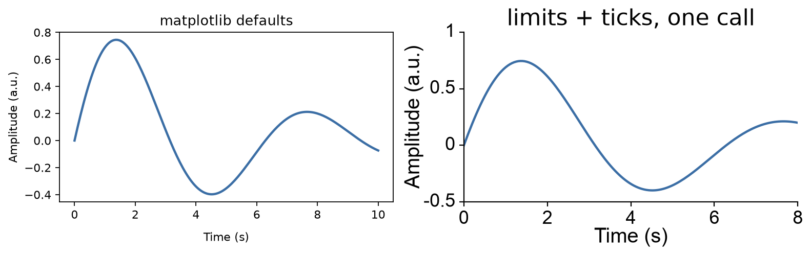

### Tick labels: text, rotation, alignment

```python
mplify(xticks=range(4), xtickslabels=categories, xtickrot=30, xtickha='right')
```

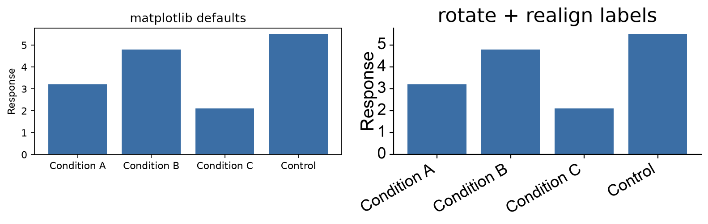

### Reference lines

```python
mplify(hlines=[0], vlines=[np.pi, 2*np.pi],
       lines_kwargs={'lw': 2, 'ls': ':', 'color': 'grey'})
```

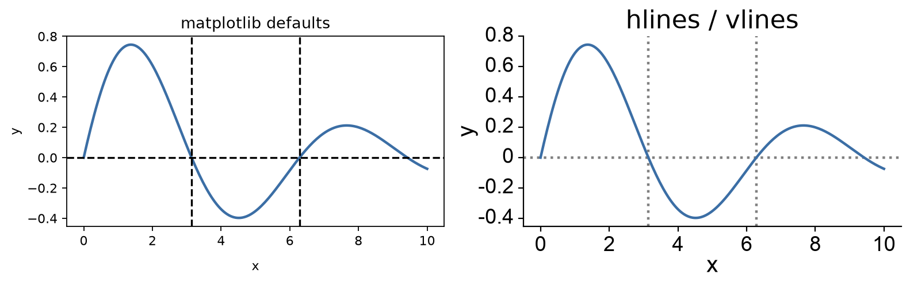

### Good-looking colorbars

By default, `plt.colorbar()` steals space from the parent axes, so a row of subplots ends up with panels of different widths — one shrunk by its colorbar, the rest not. mplify's colorbar is an inset anchored to the axis: the data area keeps the exact size and aspect ratio you gave it.

```python
mplify(colorbar=True, vmin=-3, vmax=3, cmap='RdBu_r',
       clabel='Z-score', cticks=[-2, 0, 2])
```

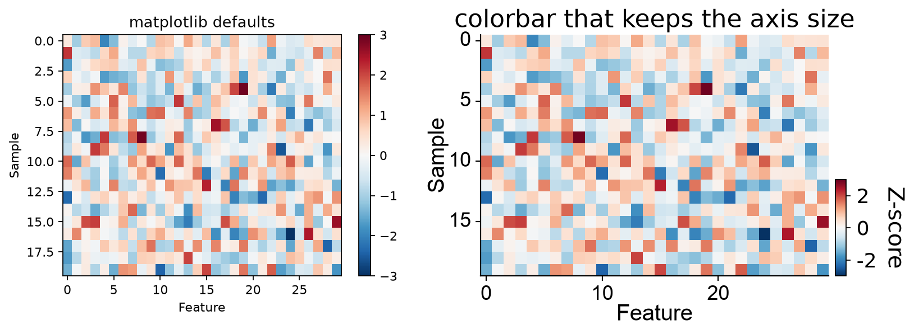

### Diverging colormaps that really center on zero

If your data span −2 to 5, `cmap='RdBu_r'` puts white at 1.5. Half your "blue" values are positive numbers. `get_bounded_cmap` re-anchors the colormap so zero maps to white, without clipping your range.

```python
cmap, vmin, center, vmax = 'RdBu_r', -2, 0, 5
# 1. the data: build the re-anchored colormap yourself and hand it to imshow (mplify doesn't edit your data)
ax.imshow(data, vmin=vmin, vmax=vmax, cmap=get_bounded_cmap(cmap, vmin, center, vmax))

# 2. the colorbar: center=0 makes mplify re-anchor its own colorbar the same way,
#    so the bar you draw matches the image you drew
mplify(colorbar=True, cmap=cmap, vmin=vmin, center=center, vmax=vmax)
```

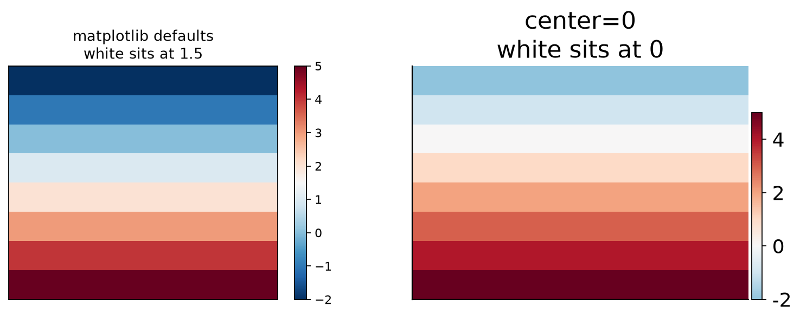

### Scalebars instead of axes

For traces where the absolute values are meaningless but the scale isn't —
ephys, imaging, anything with a time base.

```python
mplify(hide_axis=True,
       xscalebar=5, yscalebar=200,
       xscalebar_unit=' ms', yscalebar_unit=' μV')
```

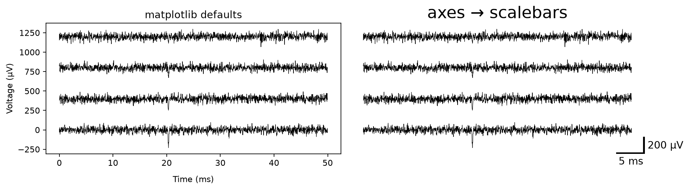

### One `size` argument for papers, slides and posters

The most common reformatting job of all: the same panel has to be legible at 30 cm in a figure of a paper, and at 3 m on a poster. `size` rescales fonts, spine widths and reference guides in one go, and touches nothing about your data.

```python
mplify(size='paper')    # or 'slide', 'poster'
mplify(size='xs')       # or 's', 'm', 'l', 'xl', 'xxl'
```

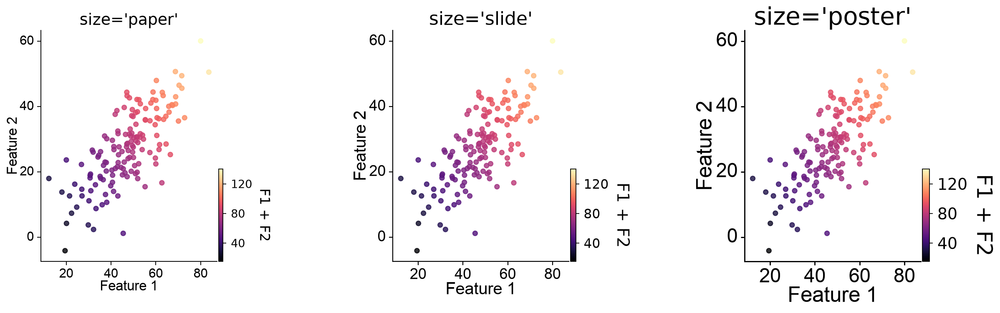

> [!NOTE]
> The size presets (`'xs'`, `'s'`, `'m'`, `'l'`, `'xl'`, `'xxl'`, `'paper'`, `'slide'`, `'poster'`) can all be edited in `DEFAULT_PARAMS.py`. `'paper'`, `'slide'` and `'poster'` are aliases for `'s'`, `'m'` and `'l'`.

> [!IMPORTANT]
> Default `mplify()` uses the `'m'` font sizes, passing *any* `size` additionally re-spaces your ticks onto round numbers (`get_bestticks`). Pass `adjust_ticks_from_size=False` to get the font scaling without the tick re-spacing.
>
> On log-scaled axes the tick re-spacing is skipped automatically, so `mplify(size=...)` leaves ticks intact.

### Multi-panel figures

`mplify()` styles **one** axis per call: the one you pass with the `ax` arg, or the currently active one (implicit in `mplify()`). To apply mplify to all axes of a grid of subplots, loop over them:

```python
fig, axes = plt.subplots(2, 2, figsize=(8, 6))
for i, ax in enumerate(axes.flat):
    ax.plot(x, y[i])
    mplify(fig=fig, ax=ax, xlabel='Time (s)', ylabel='Amplitude', size='paper')
```

A handful of arguments are figure-wide rather than per-axis — `tight_layout`, `hspace`, `wspace`, `align_x_labels`, `align_y_labels`. They act on the whole figure no matter which axis you pass, so set them once on the last call rather than in every iteration:

```python
mplify(fig=fig, ax=axes.flat[-1], tight_layout=True, hspace=0.4, wspace=0.3)
```

`align_x_labels` and `align_y_labels` are on by default: shared axis labels line up across panels automatically. Turn them off when you resize a single axis with `axsize`, or aligning will drag its label toward its un-resized neighbours.

### Bonus: color families for nested groups

For designs with a group and a level inside it (genotype × dose, region × condition): one hue family per group, one shade per level. The structure of the experiment is visible in the colors, and it survives being printed in greyscale.

```python
from mplify import get_color_families
families = get_color_families(ncolors=3, nfamilies=3, cmapstr='viridis')
```

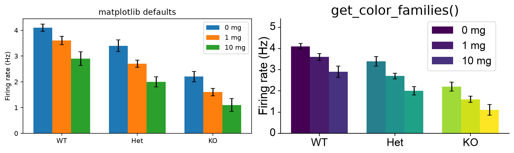

Plus the usual conveniences:

```python
from mplify import get_ncolors_cmap, to_hex, html_palette
get_ncolors_cmap(8, 'viridis')      # N evenly spaced colors from any colormap
to_hex((70, 130, 180))              # accepts 0-1 or 0-255, hex, names, 'r'
html_palette(colors)                # preview swatches inline in a notebook
```

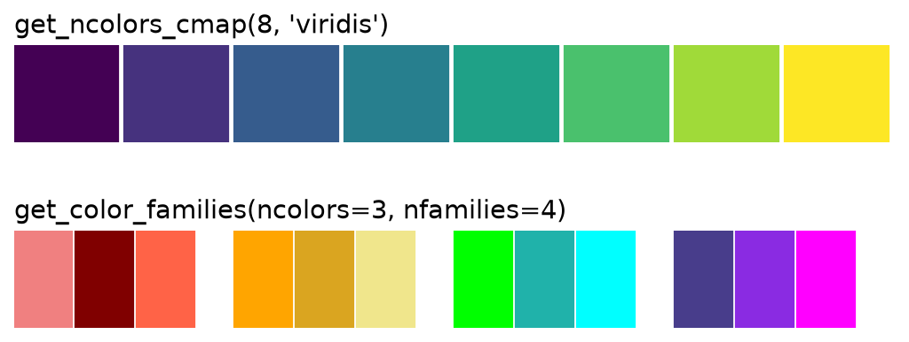

### Everything at once

```python
mplify(xlabel='Feature 1', ylabel='Feature 2',
       colorbar=True, vmin=c.min(), vmax=c.max(), cmap='magma', clabel='F1 + F2',
       hlines=[y.mean()], vlines=[x.mean()],
       lines_kwargs={'lw': 1, 'ls': '--', 'color': 'grey', 'zorder': -1})
```

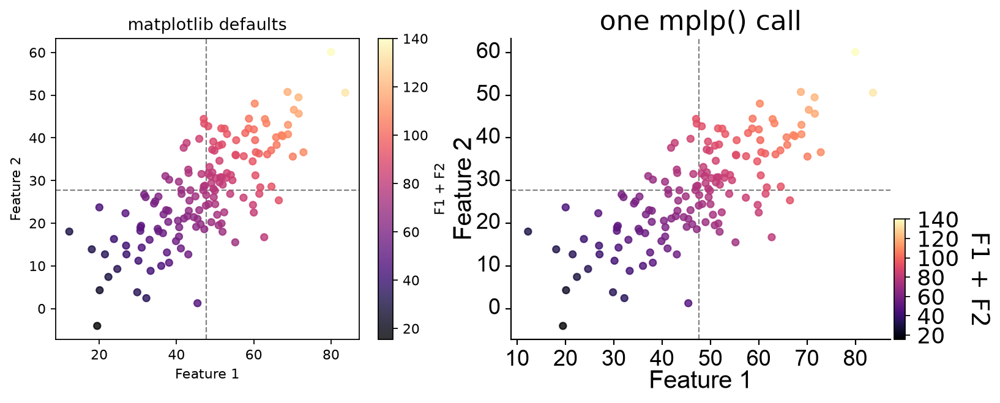

Four lines. To bring the point home, here is the raw matplotlib for that exact same panel — roughly what an LLM hands you if you ask. Note that it is *correct*; being correct was never the issue:

```python
# Raw matplotlib: the same panel, by hand
import numpy as np
from matplotlib.font_manager import FontProperties
from mpl_toolkits.axes_grid1.inset_locator import inset_axes

# labels, title, fonts
ax.set_xlabel('Feature 1', size=18, weight='regular', labelpad=0, fontname='Arial')
ax.set_ylabel('Feature 2', size=18, weight='regular', labelpad=0, fontname='Arial')
ax.set_title('by hand', size=20, weight='regular')

# tick labels — set_ticks() first, or matplotlib warns and may mislabel them
fig.canvas.draw()
xticks, yticks = ax.get_xticks(), ax.get_yticks()
ax.set_xticks(xticks)
ax.set_xticklabels([f'{t:g}' for t in xticks], fontsize=16, fontweight='regular',
                   color=(0, 0, 0), rotation=0, ha='center', va='top', fontname='Arial')
ax.set_yticks(yticks)
ax.set_yticklabels([f'{t:g}' for t in yticks], fontsize=16, fontweight='regular',
                   color=(0, 0, 0), rotation=0, ha='right', va='center', fontname='Arial')
ax.set_xlim(xlim); ax.set_ylim(ylim)   # ticks just widened your limits. put them back

# spines and ticks
ax.tick_params(axis='both', bottom=1, left=1, top=0, right=0,
               width=1, length=4, direction='out')
for sp in ('left', 'bottom'):
    ax.spines[sp].set_lw(1)
ax.spines['top'].set_visible(False)
ax.spines['right'].set_visible(False)

# reference lines
ax.axhline(y=y.mean(), lw=1, ls='--', color='grey', zorder=-1)
ax.axvline(x=x.mean(), lw=1, ls='--', color='grey', zorder=-1)

# a colorbar that doesn't steal width from the axis
cax = inset_axes(ax, width='3%', height='40%', loc='lower right',
                 bbox_to_anchor=(0.04, 0, 1, 1), bbox_transform=ax.transAxes,
                 borderpad=0)
sm = plt.cm.ScalarMappable(cmap='magma', norm=plt.Normalize(c.min(), c.max()))
sm.set_array([])
fig.colorbar(sm, cax=cax, ax=ax, orientation='vertical', label='F1 + F2')
cticks = np.arange(20, 141, 20)
cax.yaxis.set_ticks(cticks)
cax.yaxis.set_ticklabels([f'{t:g}' for t in cticks], ha='left')
cax.yaxis.set_tick_params(pad=5, labelsize=16)
cax.yaxis.label.set_font_properties(FontProperties(weight='regular', size=18))
cax.yaxis.label.set_rotation(-90)
cax.yaxis.label.set_va('bottom')
cax.yaxis.label.set_ha('center')
cax.yaxis.labelpad = 5

# line up labels across subplots, white figure background
fig.align_xlabels(fig.axes)
fig.align_ylabels(fig.axes)
fig.patch.set_facecolor('white')
```

**41 lines, three imports, six APIs, two potential bugs** (`set_ticklabels` before
`set_ticks` warns and can silently mislabel your axis; setting ticks quietly
widens your limits, so you have to restore them afterwards). Generating it takes
seconds; reading it, six months from now, does not.

### `prettify=False` — surgical mode

Sometimes you've already got a figure you like and you want to change exactly one
thing. `prettify=False` applies *only* what you pass and leaves everything else
alone.

```python
mplify(prettify=False, hide_top_right=True)
```

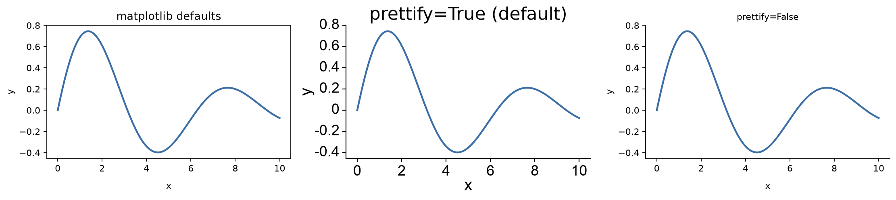

### mplify() returns the fig and ax it styled

`mplify()` returns the `(fig, ax)` it styled, so you can keep working on them, which can turn useful:

```python
fig, ax = mplify(xlabel='Time (s)')
ax.annotate('peak', xy=(3, 1))
```

---

## Cheat sheet

| Matplotlib element | Argument |
|---|---|
| Which figure / axis to style | `fig`, `ax` (default: `plt.gcf()` / `plt.gca()`) |
| Figure / axis size (inches) | `figsize=(w, h)`, `axsize=(w, h)` |
| Scale text for medium | `size='paper' / 'slide' / 'poster'` (also `xs`–`xxl`) |
| Keep matplotlib's tick spacing when using `size` | `adjust_ticks_from_size=False` |
| Limits | `xlim`, `ylim` |
| Tick positions | `xticks`, `yticks` |
| Discard set tick positions, back to matplotlib's automatic ones | `reset_xticks=True`, `reset_yticks=True` |
| Tick label text | `xtickslabels`, `ytickslabels` |
| Tick label rotation / alignment | `xtickrot`, `ytickrot`, `xtickha`, `xtickva`, `ytickha`, `ytickva` |
| Font sizes | `title_s`, `axlab_s`, `ticklab_s`, `clabel_s`, `cticks_s` |
| Font weights | `title_w`, `axlab_w`, `ticklab_w`, `clabel_w` |
| Font family | `font_family` |
| Labels / title | `xlabel`, `ylabel`, `title`, `xlabelpad`, `ylabelpad` |
| Spines | `lw`, `hide_top_right`, `hide_axis` |
| Tick direction | `ticks_direction='in' / 'out'` |
| Legend | `show_legend`, `hide_legend`, `legend_loc=(x, y)` |
| Colorbar | `colorbar=True`, `vmin`, `vmax`, `cmap`, `center`, `clabel`, `cticks`, `ctickslabels`, `cbar_w`, `cbar_h`, `cbar_pad`, `clim` |
| Reference lines | `hlines`, `vlines`, `lines_kwargs` |
| Scalebars | `xscalebar`, `yscalebar`, `xscalebar_unit`, `yscalebar_unit`, `scalebarkwargs` |
| Subplot spacing | `hspace`, `wspace`, `tight_layout` |
| Label alignment across subplots | `align_x_labels`, `align_y_labels` |
| Transparent background | `transparent_background=True` |
| Save | `saveFig=True`, `saveDir`, `figname`, `_format` |
| Change only what I pass | `prettify=False` |

### Helpers exported alongside `mplify`

| Function | Does |
|---|---|
| `get_bestticks(start, end, step=None, light=False)` | Ticks on round numbers (1 / 5 / 10 steps) |
| `get_bestticks_from_array(arr, ...)` | Same, from data |
| `get_labels_from_ticks(ticks)` | Consistently formatted tick label strings |
| `sci_notation(1.23e6, 2)` | `1.23·10⁶` as mathtext |
| `get_cmap`, `get_bounded_cmap`, `get_ncolors_cmap`, `get_color_families` | Colormaps and palettes |
| `to_rgb`, `to_hex`, `to_hsv`, `html_palette` | Color conversion and preview |
| `add_colorbar(fig, ax, ...)` | The size-preserving colorbar, standalone |
| `plot_scalebar(ax, ...)` | Scalebars, standalone |
| `set_ax_size(ax, w, h)` | Exact axis dimensions in inches, by **resizing the figure** around it |
| `save_mpl_fig(fig, name, dir, fmt)` | Save with Type-42 (editable) text |

> [!NOTE]
> `set_ax_size(ax, w, h)` and `mplify(axsize=(w, h))` sound alike but do the opposite thing. `set_ax_size` grows or shrinks the *figure* so that this axis ends up `w × h` inches — fine for a single-axis figure, disruptive for a grid. `axsize` keeps the figure exactly as it is and re-positions this one axis inside it, leaving its neighbours untouched.

---

## Saving

```python
mplify(saveFig=True, saveDir='./figures', figname='fig2b', _format='pdf')
```

Saves at 500 dpi with `pdf.fonttype = 42`, i.e. **text stays text**. You can open
the PDF in Illustrator/Inkscape and fix your typo without re-running the
analysis. (You will. There is always one more label to fix.)

Worth knowing:

- `saveDir` defaults to `~/Downloads` and `figname` to `'figure'`. Pass both unless you enjoy archaeology.
- `saveDir` is created if missing, but only one level deep — `'./figures'` works, `'./a/b/c'` raises.
- Existing files are **overwritten** without warning.
- If you set a `title` but no `figname`, the title is used as the file name.
- `transparent_background=True` carries through to the saved file, so a figure dropped on a coloured slide keeps the slide's background.

---

## Changing the defaults

mplify's defaults live in one hand-editable file,
[`src/mplify/DEFAULT_PARAMS.py`](src/mplify/DEFAULT_PARAMS.py): `default_mplify_params` for the base style, `SIZE_PRESETS` for the paper/slide/poster xs/s/m/l/xl/xxl defaults.

Edit it and your next `mplify()` call picks the change up immediately — the file is re-read from disk whenever its mtime changes. No kernel restart or `%autoreload` needed.

```python
from mplify import default_mplify_params, SIZE_PRESETS  # snapshots, for inspection
```

---

## Not a style sheet, not a wrapper

- **Not a style sheet.** Style sheets set global `rcParams` across all figures; they can't rotate specific tick labels or put a colorbar on a specific axis. mplify operates per-axis, at call time, after your data is plotted.
- **Not a plotting wrapper.** mplify never draws your data. You keep `ax.plot`, `ax.imshow`, seaborn — anything that ends up on a matplotlib axis. `mplify()` only handles what comes after.

---

## Development

```bash
uv sync                            # editable install into .venv, with dev extras
uv run ruff check src/             # lint (config in pyproject.toml)
uv run python doc/make_figures.py  # regenerate the README figures into doc/img/
```

The full gallery is [`quickstart.ipynb`](quickstart.ipynb) — open it in your editor of choice and point the kernel at `.venv`.

There is no automated test suite yet; regenerating the figures above and diffing them against `doc/img/` is the current smoke test. Contributions on that front are welcome.

## Contributing

Bug reports and feature requests: [open an issue](https://github.com/m-beau/mplify/issues). Since the API is deliberately one flat function, new arguments are added when a real figure needs them — so a short description of the plot you were trying to make is the most useful thing you can include.

## License

GPL-3.0-or-later — see [LICENSE](LICENSE). Same license as [NeuroPyxels](https://github.com/m-beau/NeuroPyxels), which this code grew out of.

## Related

[NeuroPyxels](https://github.com/m-beau/NeuroPyxels) — Neuropixels data analysis, where this codebase slowly grew up since 2016.
